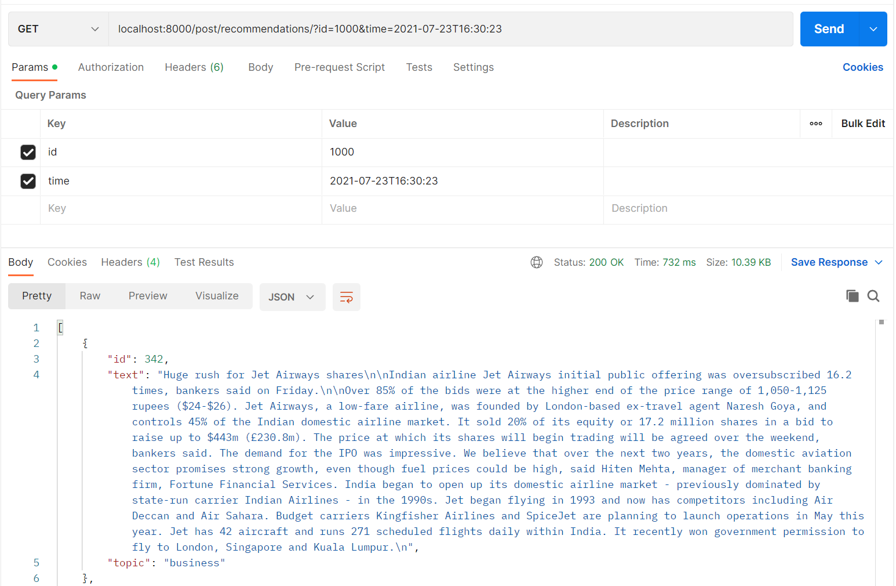

# post_recommendation_server

Финальный проект курса **StartML** (karpov.cources), представляющий собой рекомендательную систему
постов на основе градиентного бустинга (catboost). В проекте применены: выгрузка данных с помозью SQL,
обработка данных и текста (nltk, tfidf), обучение модели, а так же создание сервера (uvicorn + FastAPI)
для работы модели в реальном времени.

Данные лежат в следующих таблицах: `user_data`, `post_text_df` и `feed_data`.

### Таблица user_data

Cодержит информацию о всех пользователях соц.сети.

| Field name | Overview                                                                     |
|------------|------------------------------------------------------------------------------|
| age        | 	Возраст пользователя (в профиле)                                            |            
| city       | 	Город пользователя (в профиле)                                              |          
| exp_group  | Экспериментальная группа: некоторая зашифрованная категория                  |
| gender     | Пол пользователя                                                             |
| user_id    | Уникальный идентификатор пользователя                                        |
| os	        | Операционная система устройства, с которого происходит пользование соц.сетью |
| source     | Пришел ли пользователь в приложение с органического трафика или с рекламы    |

### Таблица post_text_df

Содержит информацию о постах и уникальный ID каждой единицы с соответствующим ей текстом и топиком.

| Field name | 	Overview                      |
|------------|--------------------------------|
| id         | Уникальный идентификатор поста |
| text       | Текстовое содержание поста     |
| topic      | Основная тематика              |

### Таблица feed_data

Содержит историю о просмотренных постах для каждого юзера в изучаемый период.

| Field name | Overview                                                                                                           |
|------------|--------------------------------------------------------------------------------------------------------------------|
| timestamp  | Время, когда был произведен просмотр                                                                               |
| user_id    | id пользователя, который совершил просмотр                                                                         |
| post_id    | id просмотренного поста                                                                                            |
| action     | Тип действия: просмотр или лайк                                                                                    |
| target     | 1 у просмотров, если почти сразу после просмотра был совершен лайк, иначе 0. У действий like пропущенное значение. |

### Запуск сервера локально:

`uvicorn app:app --reload`

### Пример выполнения запроса

ЦЦ